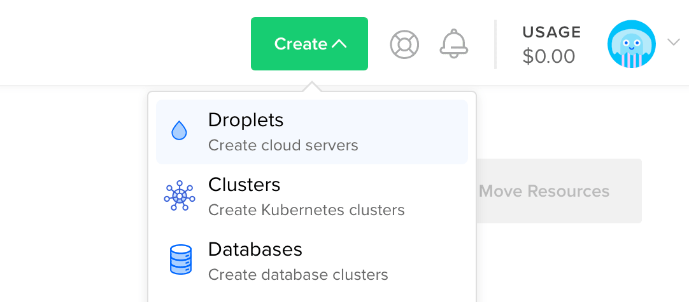
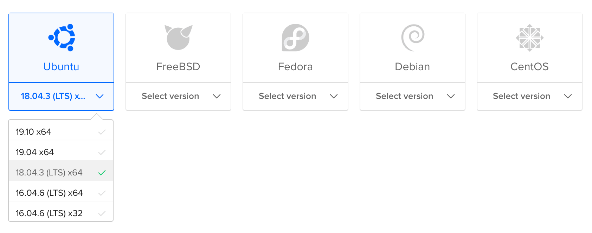
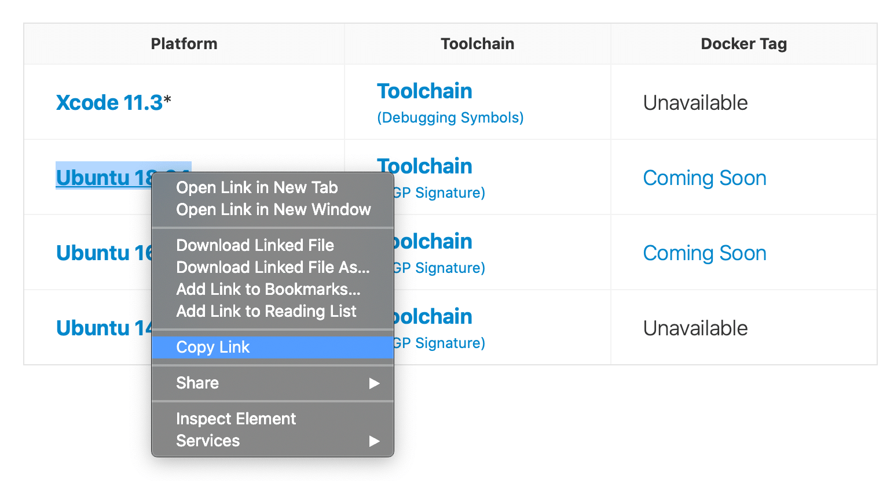

# 部署到DigitalOcean

本指南将指导您将一个简单的Hello, world Vapor应用程序部署到[Droplet](https://www.digitalocean.com/products/droplets/)。要遵循本指南，你将需要有一个[DigitalOcean](https://www.digitalocean.com)账户，并配置了计费。

## 创建服务器

让我们先在Linux服务器上安装Swift。使用创建菜单来创建一个新的Droplet。



在发行版下，选择Ubuntu 18.04 LTS。下面的指南将以这个版本为例。



!!! note 
    你可以选择任何有Swift支持的版本的Linux发行版。在撰写本文时，Swift 5.2.4 支持 Ubuntu 16.04、18.04、20.04、CentOS 8 和 Amazon Linux 2。你可以在 [Swift Releases](https://swift.org/download/#releases) 页面上查看官方支持哪些操作系统。

在选择分布后，选择你喜欢的任何计划和数据中心区域。然后设置一个SSH密钥，在服务器创建后访问它。最后，点击创建Droplet，等待新服务器启动。

一旦新服务器准备好了，将鼠标悬停在Droplet的IP地址上，点击复制。


## 初始设置

打开你的终端，用SSH以root身份连接到服务器。

```sh
ssh root@your_server_ip
```

DigitalOcean对[Ubuntu 18.04的初始服务器设置](https://www.digitalocean.com/community/tutorials/initial-server-setup-with-ubuntu-18-04)有一个深度指南。本指南将快速涵盖基础知识。

### 配置防火墙

允许OpenSSH通过防火墙并启用它。

```sh
ufw allow OpenSSH
ufw enable
```

### 添加用户

在`root`之外创建一个新的用户。本指南称这个新用户为`vapor`。

```sh
adduser vapor
```

允许新创建的用户使用`sudo`。

```sh
usermod -aG sudo vapor
```

将根用户的授权SSH密钥复制到新创建的用户。这将使你能够以新用户的身份进行SSH登录。

```sh
rsync --archive --chown=vapor:vapor ~/.ssh /home/vapor
```

最后，退出当前的SSH会话，以新创建的用户身份登录。

```sh
exit
ssh vapor@your_server_ip
```

## 安装Swift

现在你已经创建了一个新的Ubuntu服务器并以非root用户身份登录，你可以安装Swift了。

### Swift的依赖性

安装Swift的必要依赖项。

```sh
sudo apt-get update
sudo apt-get install clang libicu-dev libatomic1 build-essential pkg-config
```

###下载工具链

本指南将安装 Swift 5.2.4。请访问[Swift Releases](https://swift.org/download/#releases)页面，获取最新版本的链接。复制Ubuntu 18.04的下载链接。



下载并解压Swift工具链。

```sh
wget https://swift.org/builds/swift-5.2.4-release/ubuntu1804/swift-5.2.4-RELEASE/swift-5.2.4-RELEASE-ubuntu18.04.tar.gz
tar xzf swift-5.2.4-RELEASE-ubuntu18.04.tar.gz
```

!!! note
    Swift的[使用下载](https://swift.org/download/#using-downloads)指南包括如何使用PGP签名验证下载的信息。

### 安装工具链

将 Swift 移到容易获取的地方。本指南将使用`/swift`，每个编译器版本都在一个子文件夹中。

```sh
sudo mkdir /swift
sudo mv swift-5.2.4-RELEASE-ubuntu18.04 /swift/5.2.4
```

将Swift添加到`/usr/bin`，这样它就可以被`vapor`和`root`执行。

```sh
sudo ln -s /swift/5.2.4/usr/bin/swift /usr/bin/swift
```

验证Swift的安装是否正确。

```sh
swift --version
```

## 设置项目

现在Swift已经安装完毕，让我们来克隆和编译你的项目。在这个例子中，我们将使用Vapor的[API模板](https://github.com/vapor/api-template/)。

首先让我们安装Vapor的系统依赖项。

```sh
sudo apt-get install openssl libssl-dev zlib1g-dev libsqlite3-dev
```

允许HTTP通过防火墙。

```sh
sudo ufw allow http
```

### 克隆和构建

现在克隆项目并构建它。

```sh
git clone https://github.com/vapor/api-template.git
cd api-template
swift build --enable-test-discovery
```

!!! tip
    如果你要为生产构建这个项目，请使用`swift build -c release --enable-test-discovery`。

### 运行

一旦项目完成编译，在你的服务器IP上以80端口运行。本例中的IP地址是`157.245.244.228`。

```sh
sudo .build/debug/Run serve -b 157.245.244.228:80
```

如果你使用`swift build -c release --enable-test-discovery`，那么你需要运行。
```sh
sudo .build/release/Run serve -b 157.245.244.228:80
```

通过浏览器或本地终端访问你的服务器的IP，你应该看到 "It works!"。

```
$ curl http://157.245.244.228
It works!
```

回到你的服务器上，你应该看到测试请求的日志。

```
[ NOTICE ] Server starting on http://157.245.244.228:80
[ INFO ] GET /
```

使用`CTRL+C`来退出服务器。它可能需要一秒钟的时间来关闭。

祝贺你在DigitalOcean Droplet上运行你的Vapor应用程序!

## 接下来的步骤

本指南的其余部分指出了其他资源，以改善你的部署。

### Supervisor

Supervisor是一个过程控制系统，可以运行和监控你的Vapor可执行文件。通过设置监督器，你的应用程序可以在服务器启动时自动启动，并在服务器崩溃时重新启动。了解更多关于[Supervisor](.../deploy/supervisor.md)。

### Nginx

Nginx是一个速度极快、经过战斗检验、易于配置的HTTP服务器和代理。虽然Vapor支持直接提供HTTP请求，但在Nginx后面的代理可以提供更高的性能、安全性和易用性。了解更多关于[Nginx](.../deploy/nginx.md)。
